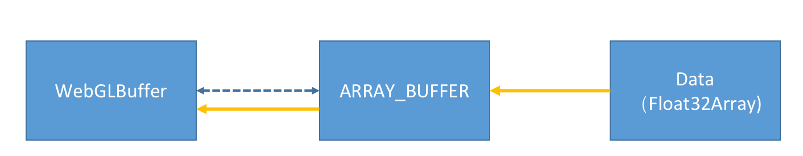
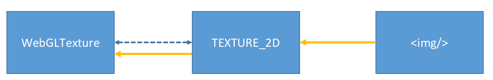

# WebGL 基础

> **WebGL**（Web Graphics Library）即 Web 绘图协议，将**JavaScript**与 **OpenGL ES** 相结合，使得 Web 开发能够直接利用 WebGL 提供的 API 进行网页 2D 或 3D 图形绘制，然后利用图形处理器 GPU 进行硬件加速图形的渲染处理。
>
> 注：OpenGL（全写 Open Graphics Library）是个定义了一个跨编程语言、[跨平台](https://baike.baidu.com/item/跨平台)的[编程接口](https://baike.baidu.com/item/编程接口)的规格，它用于三维图象（二维的亦可）。OpenGL 是个专业的图形程序接口，是一个功能强大，调用方便的底层图形库。

[WebGL](https://www.khronos.org/webgl/) 使得网页在支持 HTML [canvas](https://developer.mozilla.org/zh-CN/docs/Web/HTML/Element/canvas) 标签的浏览器中，不需要使用任何插件，便可以使用基于 [OpenGL ES](https://www.khronos.org/opengles/) 2.0 的 API 在 canvas 中进行 3D 渲染。

## WebGL 上下文

[canvas](https://developer.mozilla.org/zh-CN/docs/Web/HTML/Element/canvas) 是浏览器绘制图形的画布，在绘制之前我们首先都需要通过 [getContext](https://developer.mozilla.org/zh-CN/docs/Web/API/HTMLCanvasElement/getContext) 函数获取**渲染上下文**，不同的上下文为画布绘图提供了不同的 API，目前支持的渲染上下文有：

- **2d**：建立一个 [`CanvasRenderingContext2D`](https://developer.mozilla.org/zh-CN/docs/Web/API/CanvasRenderingContext2D) 二维渲染上下文。
- **webgl**：或 experimental-webgl，将创建一个 [`WebGLRenderingContext`](https://developer.mozilla.org/zh-CN/docs/Web/API/WebGLRenderingContext) 三维渲染上下文对象。只在实现[WebGL](https://developer.mozilla.org/en-US/docs/Web/WebGL) 版本 1(OpenGL ES 2.0)的浏览器上可用。
- **webgl2**：或 experimental-webgl2，这将创建一个 [`WebGL2RenderingContext`](https://developer.mozilla.org/zh-CN/docs/Web/API/WebGL2RenderingContext) 三维渲染上下文对象。只在实现 [WebGL](https://developer.mozilla.org/en-US/docs/Web/WebGL) 版本 2 (OpenGL ES 3.0)的浏览器上可用。（实验）
- **bitmaprenderer**：将创建一个只提供将 canvas 内容替换为指定[`ImageBitmap`](https://developer.mozilla.org/zh-CN/docs/Web/API/ImageBitmap)功能的[`ImageBitmapRenderingContext`](https://developer.mozilla.org/zh-CN/docs/Web/API/ImageBitmapRenderingContext) 。

如果返回 null，则说明执行脚本的浏览器环境不支持该类型的渲染上下文。

下面是获取上下文的简单<span class="example" key="1">示例 1</span>：

```ts
/**
 * 获取webgl渲染上下文
 */
export function getWebGLContext() {
  const canvas = $$("#glcanvas") as HTMLCanvasElement;
  /**WebGl上下文 */
  const gl = canvas && canvas.getContext("webgl");
  if (!gl) {
    alert("无法初始化WebGL，你的浏览器、操作系统或硬件等可能不支持WebGL。");
    return;
  }
  // 使用完全不透明的黑色清除所有图像
  gl.clearColor(0, 0, 0, 1);
  // 用上面指定的颜色清除缓冲区
  gl.clear(gl.COLOR_BUFFER_BIT);
}
```

## 绘制 2D 内容

当我们获取了渲染上下文后，就能使用上下文的 API 来绘图了，最简单的就是绘制一些简单的 2D 内容，如线条，矩形等等。

需要明确的是，虽然我们绘制的是 2D 平面物体，但我们仍然把它绘制再三维空间中，因此，我们需要创建**着色器**来帮助我们在上下文中渲染物体。本章接将从一些基础概念讲起，最后在画布上绘制出一个简单的正方形。

重要概念清单：[着色器](#着色器（Shader）)、[着色器程序](#着色器程序（Shader Program）)、[矩阵](#矩阵)。

### 着色器（Shader）

着色器是使用 [OpenGL ES 着色语言](https://www.khronos.org/registry/gles/specs/2.0/GLSL_ES_Specification_1.0.17.pdf) 编写的程序，它携带着绘制形状的**顶点信息**以及构造在屏幕像素上的所需数据，换句话说，着色器就是记录着像素点**位置**和**颜色数据**的程序。想象一下，有了颜色和颜色具体的绘制位置，是不是就可以在显示屏上绘制出想要的带色彩图形了。

根据上面的描述，着色器有两个关键信息：像素点的位置和该位置的颜色信息。对应地，在 WebGL 中就划分为两种着色器：**顶点着色器**和**片段着色器**。简单来说，顶点着色器就是负责记录像素点位置，而片段着色器负责记录颜色数据，两者合并请来就是完整的**着色器程序**，就能通过着色器程序绘制像素图案。

#### 顶点着色器（Vertex Shader）

> 在 WebGL 中，属于 [WebGLShader]([WebGLShader - Web API 接口参考 | MDN (mozilla.org)](https://developer.mozilla.org/zh-CN/docs/Web/API/WebGLShader)) 接口，用于记录像素**位置**信息。

每次渲染一个形状时，顶点着色器会在形状中的每个顶点运行。它的工作是将输入顶点从原始坐标系转换到 WebGL 使用的缩放空间(clipspace)坐标系（每个坐标轴的坐标范围都是[-1, 1]，且不考虑纵横比，实际尺寸和任何其他因素）。WebGL 缩放坐标系简单理解就是**单位坐标系**，不管实际尺寸多大多小的物体都进行缩放后变成单位坐标系的大小。

顶点着色器需要对顶点坐标进行必要的转换，在每个顶点基础上进行其他调整或计算，然后通过将其保存在由 GLSL 提供的特殊变量（我们称为**gl_Position**）中来返回变换后的顶点。

以下的顶点着色器接收一个我们定义的属性（**aVertexPosition**）的顶点位置值。之后这个值与两个 4x4 的矩阵（**uProjectionMatrix**和**uModelMatrix**）相乘; 乘积赋值给 **gl_Position**。有关投影和其他矩阵的更多信息，[在这里您可能可以找到有帮助的文章](https://webglfundamentals.org/webgl/lessons/webgl-3d-perspective.html).。

```ts
// 顶点着色器程序(GLSL源码)
const vsSource = `
    attribute vec4 aVertexPosition;

    uniform mat4 uModelViewMatrix;
    uniform mat4 uProjectionMatrix;

    void main() {
      gl_Position = uProjectionMatrix * uModelViewMatrix * aVertexPosition;
    }
 `;
```

> 在这个顶点着色器程序中，没有加入光照效果和纹理效果，这些内容将在之后的章节补充

#### 片段着色器（Fragment Shader）

> 在 WebGL 中，属于 [WebGLShader]([WebGLShader - Web API 接口参考 | MDN (mozilla.org)](https://developer.mozilla.org/zh-CN/docs/Web/API/WebGLShader)) 接口，用于记录像素**颜色**信息。

片段着色器在顶点着色器处理完图形顶点后，会被要绘制每个图形的每个像素点调用一次。它的职责是确定调用像素点的颜色，通过指定应用到像素的纹理元素（也就是图形纹理中的像素），获取纹理元素的颜色，然后再应用光照效果，就得到了适合的颜色，该值会存储到变量**gl_FragColor**中，然后 WebGL 就能在显示器上显示该像素点的颜色，绘制出实际图形。

```ts
const fsSource = `
    void main() {
      gl_FragColor = vec4(1.0, 1.0, 1.0, 1.0);
    }
`;
```

#### 着色器的创建和使用

通过 [gl.createShader](https://developer.mozilla.org/zh-CN/docs/Web/API/WebGLRenderingContext/createShader) 来创建着色器，然后通过 [gl.shaderSource()](https://developer.mozilla.org/zh-CN/docs/Web/API/WebGLRenderingContext/shaderSource) 设置 GLSL 程序代码，最后调用 [gl.compileShader()](https://developer.mozilla.org/zh-CN/docs/Web/API/WebGLRenderingContext/compileShader) 完成做色器的编译工作，但是，着色器不**能直接被 webgl 使用**，我们需要同时挂载两个着色器（顶点着色器和片段着色器）到 WebGL 程序上，然后通过程序的使用来体现着色器的功能。

### 着色器程序（Shader Program）

> 在 WebGL 中，称为 [WebGLProgram]([WebGLProgram - Web API 接口参考 | MDN (mozilla.org)](https://developer.mozilla.org/zh-CN/docs/Web/API/WebGLProgram))，由**一个**顶点着色器和**一个**片段着色器组成。

创建一个 WebGL 程序需要调用 [gl.createProgram()](https://developer.mozilla.org/zh-CN/docs/Web/API/WebGLRenderingContext/createProgram) 方法，然后调用 [gl.attachShader()](https://developer.mozilla.org/zh-CN/docs/Web/API/WebGLRenderingContext/attachShader) 方法绑定着色器，这样，这个程序才能被 WebGL 绘图上下文使用。

以下是一个 WebGL 程序能正常使用的执行步骤：创建、绑定着色器、链接到上下文中：

```ts
// 创建WebGL程序
const program = gl.createProgram();

// 添加预先定义好的着色器
gl.attachShader(program, vertexShader);
gl.attachShader(program, fragmentShader);

// 链接给定的程序，从而完成该程序的顶点着色器和片段着色器准备GPU代码的过程
gl.linkProgram(program);

// 判断程序是否可用
if (!gl.getProgramParameter(program, gl.LINK_STATUS)) {
  var info = gl.getProgramInfoLog(program);
  throw "WebGL program 不能编译. \n\n" + info;
}
```

当 WebGL 程序能正常使用之后，我们就可以使用该程序，绑定合适的数据缓冲，配置相关属性参数，然后就能将图形绘制到画布上：

```ts
// 当定义好的程序添加到当前上下文的渲染状态中
gl.useProgram(program);

// 绑定数据缓冲
gl.bindBUffer(gl.ARRAY_BUFFER, buffer);
// 激活属性
gl.enableVertexAttribArray(attributeLocation);
// 读取当前绑定缓冲数据的顶点数据
gl.vertexAttribPointer(attributeLocation, 3, gl.FLOAT, false, 0, 0);

// 从向量数据中绘制图形
gl.drawArrays(gl.TRIANGLES, 0, 3);
```

> 缓冲（Buffer）：表示一个不透明的缓冲区对象，储存诸如顶点或着色之类的数据。参见：[WebGLBuffer - Web API 接口参考 | MDN (mozilla.org)](https://developer.mozilla.org/zh-CN/docs/Web/API/WebGLBuffer)
>
> 属性（Attributes）：**Attributes** 可以被 JavaScript 代码操作，也可以在 vertex shader 中被作为变量访问。Attributes 通常被用于存储颜色、纹理坐标以及其他需要在 JavaScript 代码和 vertex shader 之间互相传递的数据。参见：[Data in WebGL - Web API 接口参考 | MDN (mozilla.org)](https://developer.mozilla.org/zh-CN/docs/Web/API/WebGL_API/Data#attributes)

**总结**来说，我们需要在显示器上显示图像，就需要知道描绘图像的像素点和以及像素点上的颜色：存储像素点和像素点颜色的对象我们称为**着色器（Shader）**，所以，显示器绘图的本质就是**通过着色器来绘制一个个像素点**。

在 WebGL 中，像素点的位置信息抽象为**顶点着色器（Vertex Shader）**,像素点的颜色信息抽象为**片段着色器（Fragment Shader）**，两个着色器组合起来称之为**WebGL 程序（Program）**，程序结合存储数据的**缓冲（Buffer）**、**属性信息（Attributes）**，就能在画布上绘制出图形啦。

因此，**webgl 绘制图形的基本步骤**：

- 初始化着色器：创建着色器、绑定 GLSL 源码
- 初始化 WebGL 程序：创建程序、添加着色器、链接到绘图上下文
- 使用程序：添加程序到渲染状态中、绑定缓冲数据、激活相关属性、读取缓冲数据

### 封装工具类

为了更方便地使用 WebGL API，我们封装一个通用的工具函数类：

```ts
/**
 * WebGL渲染器
 * @description WebGL绘图上下文相关API的封装
 */
export class WebGLRender {
  /**画布容器 */
  readonly canvas: HTMLCanvasElement;
  /**上下文属性 */
  readonly gl_attributes: WebGLContextAttributes;
  /**上下文 */
  readonly gl: WebGLRenderingContext;

  constructor(
    canvas: HTMLCanvasElement,
    gl_attributes: WebGLContextAttributes
  ) {
    this.canvas = canvas;
    this.gl_attributes = gl_attributes;
    this.gl = canvas.getContext("webgl", gl_attributes);
  }

  /**
   * 创建着色器
   * @param type 着色器类型
   * @param source 着色器FGSL程序源码
   */
  createShader(type: WebGLShaderType, source: string) {
    const gl = this.gl;
    // 创建着色器
    const shader = gl.createShader(gl[type]);
    if (!shader) {
      throw new Error("invalid shader type: " + type);
    }
    // 挂在源码并编译
    gl.shaderSource(shader, source);
    gl.compileShader(shader);

    // 检测是否编译成功
    if (!gl.getShaderParameter(shader, gl.COMPILE_STATUS)) {
      const info = gl.getShaderInfoLog(shader);
      gl.deleteShader(shader);
      throw new Error("An error occurred compiling the shaders: " + info);
    }

    return shader;
  }

  /**
   * 创建着色器程序
   * @param vs 顶点着色器
   * @param fs 片段着色器
   */
  createProgram(vs: WebGLShader, fs: WebGLShader) {
    const gl = this.gl;

    // 创建WebGL程序
    const program = gl.createProgram();

    // 添加预先定义好的着色器
    gl.attachShader(program, vs);
    gl.attachShader(program, fs);

    // 链接程序，从而完成该程序的顶点着色器和片段着色器准备GPU代码的过程
    gl.linkProgram(program);

    // 判断程序是否可用
    if (!gl.getProgramParameter(program, gl.LINK_STATUS)) {
      const info = gl.getProgramInfoLog(program);
      throw "WebGL program compile failed! \n\n" + info;
    }

    return program;
  }

  /**
   * 创建着色器程序
   * @param vs_source 顶点着色器源码
   * @param fs_source 片段着色器源码
   */
  createProgramBySource(vs_source: string, fs_source: string) {
    const vs = this.createShader(WebGLShaderType.VERTEX_SHADER, vs_source);
    const fs = this.createShader(WebGLShaderType.FRAGMENT_SHADER, fs_source);
    return this.createProgram(vs, fs);
  }
}
```

### 着色器程序传递数据的三种变量限定词：`attribue`、`uniform`和`varying`

以上三种变量不是类型变量（如`int`, `string`之类），而是范围变量，划定了其在着色器程序中个使用范围：

- attribute：只在顶点着色器中使用，支持外部（WebGL）向其赋值。
- uniform：可在顶点着色器和片段着色器中使用，同样支持外部（WebGL）向其赋值，与`attribute`不同的是，`uniform`相对于当前程序相当于全局变量，即程序执行赋值过后，下次程序执行无需赋值，会保留上一次的赋值数据。
- varying：顶点着色器向片段着色器传递数据的桥梁，不支持外部传值。

### 数据传递

在着色器程序中我们可以定义多种变量，而传递数据的三种变量限定词有：`attribute`、`uniform`和`varing`，那么这些数据又是通过什么表示和传递的？主要可以分为以下三类数据：

#### 顶点数据（缓冲 | WebGLBuffer）

> 在 WebGL 中，使用 [WebGLBuffer](https://developer.mozilla.org/zh-CN/docs/Web/API/WebGLBuffer) 记录，表示一个不透明的**缓冲**区对象，储存诸如顶点或着色之类的数据。

使用步骤：

- 创建缓冲：`gl.createBuffer()`
- 绑定缓冲：`gl.bindBuffer(gl.ARRAY_BUFFER, buffer)`
- 初始化数据存储区（写入数据）：`gl.bufferData()`
- 读取数据：`gl.vertexAttribPointer ()`告诉显卡从当前绑定的缓冲区（`bindBuffer()`指定的缓冲区）中读取顶点数据
- 与属性建立联系：`gl.enableVertexAttribArray ()`

其中，`WebGLBuffer`本质上就是 js 中的类型数组：



这样，js 就可以用类型数组描述顶点数据，并通过上述步骤 API 绑定到创建的缓冲区，再与着色器程序中的属性建立关联，然后就能告知 GPU 读取缓冲区数据到着色器程序中执行了。

#### 纹理数据（WebGLTexture）

> **纹理**一般表示物体表面细节的一幅或几幅二维图形，也称纹理[贴图](https://baike.baidu.com/item/贴图)（_texture mapping_）当把纹理按照特定的方式映射到物体表面上的时候能使物体看上去更加真实。
>
> 在 WebGL 中，使用 [WebGLTexture](https://developer.mozilla.org/zh-CN/docs/Web/API/WebGLTexture) 表示，为不透明的纹理对象提供储存和状态等纹理操作。

纹理数据的传递和顶点数据类似：

- 创建纹理对象：`gl.createTexture()`
- 设置纹理裁剪参数：`gl.texParameter[fi]()`
- 绑定纹理对象：`gl.bindTexture(gl.TEXTURE_2D, texture)`
- 设置纹理图像：纹理图源可以有很多类型，如 img、video、canvas 或 ImageBitMap，使用`gl.texImage2D`设置图像。



#### uniform 类型数据

除了使用缓冲传递数据到着色器中，如果是`uniform`类型的变量，还可以使用`gl.uniformMatrix[234]x[234]fv()`方法。

### 绘制一个正方形

要在画布上绘制出一个正方形，我们执行以下逻辑：

- 创建一个着色器程序
  - 顶点着色器
  - 片段着色器
  - webgl 程序
- 创建缓冲以传递顶点数据
- 进入渲染状态，传递`uniform`类型值
- 渲染（绘制）画布

点击<span class="example" key="2">示例 2</span>可预览绘制效果。

```ts
/**
 * 绘制一个正方形
 */
export function drawASquare() {
  // 构建渲染器
  const render = new WebGLRender($$("#glcanvas") as HTMLCanvasElement);
  const gl = render.gl;
  // 初始化画布
  initCanvas(gl);
  // 创建着色器程序
  const program = createProgram(render);
  // 创建顶点缓冲并关联顶点属性
  loadVertexBuffer(render, program);
  // 开启渲染状态，传递 uniform 变量值
  loadUniform(render, program);
  // 绘制
  draw(gl);
}
```

代码细节可查阅`src/examples/2.draw2d.ts`文件。可能查阅代码细节后还有诸多疑惑，比如着色器程序源码的编写、矩阵的计算等，这些都需要专门的学习，由于内容较多，不在此处展开说明。

- GLSL 相关知识可参阅：[todo - 待补充]()

- 矩阵相关知识可参阅：[todo - 待补充]()

## 使用着色器赋予颜色

上文绘制的正方形我们只设置了**顶点缓冲**用于绘制形状，而专门负责颜色的片段着色器还未进行颜色的渲染，我们在代码里写死了`gl_FragColor = vec4(1.0, 1.0, 1.0, 1.0)`，内置变量`gl_FragColor`所输出的颜色用于随后的像素操作，所以顶点都被渲染为了白色，所绘制出来的正方形也就变成了白色。

本章节的主要内容就是着色器颜色的设置和使用，假设本节的任务就是给正方形四个顶点设置不同的颜色。

现在我们需要从外部传递顶点颜色来覆盖内置变量`gl_FragColor`，在片段着色器中，我们可以使用`uniform`和`varying`两种类型，在本案例中，我们需要为每个顶点设置不同颜色，所以更好地方法是使用顶点缓冲数据来传值，就像`aVertexPosition`属性那样，所以更适合使用`varying`类型接收从顶点着色器传来的顶点颜色值。

因此我们需要改造以下着色器源码：

- 片段着色器：增加`varying`类型变量**vColor**，用于接收顶点着色器传过来的色值。

  ```ts
  const fs = `
    varying lowp vec4 vColor;
    void main() {
      gl_FragColor = vColor;
    }
  `;
  ```

- 顶点着色器：增加`attribute`类型变量**aVertexColor**，用于接收外界（JavaScript）设置的颜色缓冲，然后传递给**vColor**变量。

  ```ts
  const vs = `
    attribute vec4 aVertexPosition;
    attribute vec4 aVertexColor;
  
    uniform mat4 uModelViewMatrix;
    uniform mat4 uProjectionMatrix;
  
    varying lowp vec4 vColor;
  
    void main() {
      gl_Position = uProjectionMatrix * uModelViewMatrix * aVertexPosition;
      vColor = aVertexColor;
    }
  `;
  ```

修改好了源码，我们只需要把**颜色缓冲**数据传递给`aVertexColor`属性即可，这和把**位置缓冲**传递给`aVertexPosition`属性的做法是一致的，所以我们只需要修改一下`loadVertexBuffer`即可：

点击<span class="example" key="3">示例 3</span>可预览绘制效果。

```ts
function loadVertexBuffer(render: WebGLRender, program: WebGLProgram) {
  // 设置顶点华冲
  // ...
  // 设置颜色缓冲
  const colors = [
    1,
    1,
    1,
    1, // 白色
    1,
    0,
    0,
    1, // 红色
    0,
    1,
    0,
    1, // 绿色
    0,
    0,
    1,
    1, // 蓝色
  ];
  const colorAttrOpt: VertexAttrOption = {
    index: render.getAttribLocation(program, "aVertexColor"),
    size: 4,
    type: WebGLVertexDataType.FLOAT,
    normalized: false,
    stride: 0,
    offset: 0,
  };
  render.createBuffer(
    {
      data: new Float32Array(colors),
      usage: WebGLBufferUsage.STATIC_DRAW,
    },
    colorAttrOpt
  );
}
```

## 让对象动起来

## 创建 3D 物体

## 使用纹理贴图

## 使用灯光

## 动画纹理贴图

## 扩展阅读

- [入门 WebGL，看这一篇就够了](https://xie.infoq.cn/article/511aa64f69530ed3061829351)
- [WebGL 教程 - MDN](https://developer.mozilla.org/zh-CN/docs/Web/API/WebGL_API/Tutorial)
- [GL Shader Language（GLSL）详解-基础语法 - 知乎 (zhihu.com)](https://zhuanlan.zhihu.com/p/349296191)
- [从 WebGL 到 WebGPU，网页图形的全新时代](https://new.qq.com/omn/20211220/20211220A03ZJM00.html)
- [WebGL 与 WebGPU 比对](https://juejin.cn/post/7053137406463049742)
- https://book.douban.com/subject/26916420/
- https://book.douban.com/subject/25909351/
